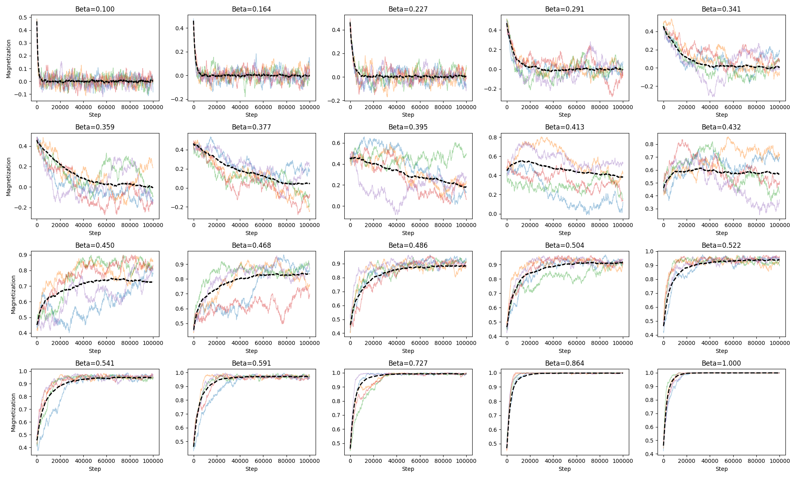
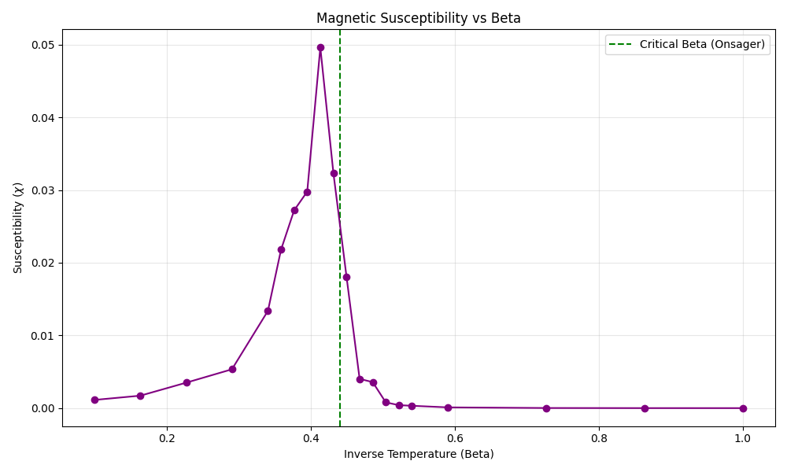

# Spin System

## Project Goal
The goal of this project is to provide a highly modular, TensorFlow-based framework for simulating the dynamics of classical spin systems. By leveraging TensorFlow, the project aims to utilize vectorization and potential GPU acceleration to efficiently simulate large lattices and complex interactions. The framework is designed to be easily extensible, allowing researchers to define new models, interactions, and dynamic rules with minimal effort.

## Current State
The project currently supports the following features:
- **Models**: unit-vector spin models including Ising (discrete) and Spherical (continuous) systems.
- **Interactions**: Arbitrary pairwise coupling tensors, with built-in generators for Periodic Nearest-Neighbor, Decaying, Curie-Weiss, and Gaussian random interactions.
- **Dynamics**: Metropolis-Hastings Monte Carlo dynamics.
- **Measurements**: Real-time tracking of scalar observables (Energy, Magnetization) and susceptibility.

## Main Differences
Compared to other available options for Spin Dynamics:
- **TensorFlow Backend**: Utilizes modern tensor operations for performance, significantly speeding up updates on large lattices compared to pure Python loops.
- **Modular Architecture**: Decouples the physical model (spins), the interaction topology (couplings), and the time evolution (dynamics), making it easier to mix and match components.
- **Flexible Tracking**: Includes a specialized `Tracker` class that can conceptually handle any observable that can be computed from the system state, recording history efficiently using `TensorArray`s.

## Walkthrough: src/spin_engine

The core logic resides in `src/spin_engine`, organized into four main modules. Here is how they interact:

### 1. models
**Purpose**: Defines the physical system, including the lattice structure, spin dimensionality (discrete vs continuous), and the energy function.
- **Interactions**: Holds `spin_state` (the actual configuration) and `interaction_matrix` (the couplings).
- **Key Class**: `BaseSpinSystem` provides the interface. `IsingSystem` and `SphericalSystem` are concrete implementations.

### 2. interactions
**Purpose**: Generates the coupling tensors ($J_{ij}$) that define the connectivity of the system.
- **Interactions**: Used by `models` to initialize the system's Hamiltonian.
- **Key Classes**: `PeriodicNearestNeighborInteraction` (standard d-dimensional lattice), `DecayingInteraction`, `CurieWeissInteraction`.

### 3. dynamics
**Purpose**: Defines the rules for time evolution.
- **Interactions**: Takes a `system` and modifies its `spin_state` over time.
- **Key Classes**:
    - `MetropolisHastings`: Performs Monte Carlo sweeps. It proposes changes (flips or rotations), computes energy differences ($\Delta E$), and accepts/rejects based on thermal probabilities.
    - `Tracker`: Observes the simulation. It is passed to the `sweep` method to record measurements at specified intervals.

### 4. measurements
**Purpose**: Defines observables to be tracked.
- **Interactions**: Instantiated with a `system` reference. Called by `Tracker` during the simulation to compute values like total energy or magnetization.
- **Key Classes**: `Energy`, `Magnetization`, `MagneticSusceptibility`.

### Interaction Flow
1. **Define Interaction**: Generate an interaction matrix (e.g., Nearest Neighbor).
2. **Create Model**: Initialize a System (e.g., Ising) with the lattice size and interaction matrix.
3. **Setup Logic**: Instantiate `MetropolisHastings` dynamics with the system.
4. **Prepare Tracking**: Create a `Tracker` with desired `Measurements`.
5. **Run**: Execute `dynamics.sweep()`, passing the `Tracker`.

## Examples

The `examples/` directory contains scripts demonstrating the framework capabilities.

### Ising Model Evolution
The script `examples/ising.py` performs a temperature sweep on a 2D Ising model. It illustrates phase transitions by tracking magnetization across different inverse temperatures (Beta).

#### Magnetization Evolution
The following plot shows the Monte Carlo time evolution of magnetization for various temperatures. Note the rapid convergence to zero magnetization at high temperatures (low Beta) and stable non-zero magnetization at low temperatures (high Beta).

#### Magnetic Susceptibility
The project successfully reproduces the critical behavior of the 2D Ising model. The plot below shows the magnetic susceptibility peaking around the critical point ($\beta_c \approx 0.44$), indicating the phase transition.

## Contact

**Lucas Gomes de Oliveira Corbanez**
- Email: lucascorbanez@gmail.com
- Institutional: lucas.gomes.oliveira@uel.br
